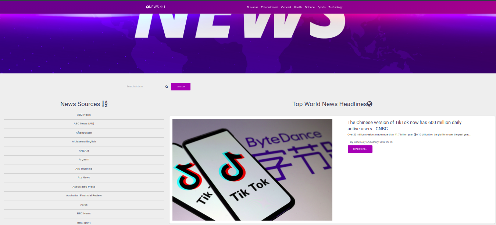

# nEws-411
### 11.09.2020
####  A Python Flask web application which lists and previews news articles from various sources using the News API

## Author
[Dennis Kamunya](https://github.com/D-Kamunya)

## Versioning
nEws-411 V1.0

## Description
An application which lists and previews news articles from various sources using the [News API](https://newsapi.org/), made by python web framework, Flask.A user can also search for their news articles using the application.
The link to the live site is 

## Features
Here are the features in summary:
* A landing page showing top world headline news,search bar to search for news articles and a variety of news sources
* Clickable news sources which direct the user to a page with article highlights from the particular source.
* Clickable news articles which direct the user to the source website to read full article details

## User Stories
* A user I can view various news sources on the homepage of the application.
* A user can select a news source and see all news articles from the selected news source in the application.
* A user can search for a news article on the homepage.
* A user can see the image, description,author and the time a news article was created.
* A can click on an article and read the full article on the source website.

## Behaviour Driven Development (BDD)
|Behaviour 	           |    Input 	                 |       Output          |
|----------------------------------------------|:-----------------------------------:|-----------------------------:|       
|Page loads, user arrives in the landing page, is greeted to a list of all available news sources.                        |  The user can click on any particulr list group item to be directed to a separate page containing news highlights curated by the same publisher.          | On clicking the "read more" button, the user is redirected to the main article to read the full story.    |                       |

## Technologies Used
* Python 3.7.4
* HTML  
* CSS
* MDB 4.8.10

## Requirements
* This program requires python3.+ (and pip) installed, a guide on how to install python on various platforms can be found [here](https://www.python.org/)

## Setup/Installation
Here is a run through of how to set up the application:
* **Step 1** : Clone this repository using **`git clone https://github.com/D-Kamunya/news-411.git`**, or downloading a ZIP file of the code.
* **Step 2** : The repository, if downloaded as a .zip file will need to be extracted to your preferred location and opened
* **Step 3** : Go to the project root directory and  create a virtual environment. Run the following commands respectively:
    * **`python3.8 -m venv --without-pip virtual`**
    * **`source virtual/bin/activate`**
        * Note that you can exit the virtual environment by running the command **`deactivate`**
* **Step 4** :  Download the latest version of pip in virtual our environment.   
    * **`curl https://bootstrap.pypa.io/get-pip.py | python`**  
* **Step 5** : Download the all dependencies in the requirements.txt using **`pip install <name>`**
* **Step 6** : Go to the [news API]() WEBSITE, sign up for a free account and generate an API key. 
    * Create a file in your root directory called start.sh and store the API key like so **`export API_KEY="<your-key>"`**
    * On the same file write down the command **`python3 manage.py server`** 
* **Step 7** : On your terminal, run the following command, **`chmod a+x start.sh`**
    * You can now launch the application locally by running the command **`./start.sh`** 
    * Open your preferred browser and view the app by opening the link **http://127.0.0.1:5000/**.

## Known Bugs
* No known bugs
Be sure to report more bugs by contacting me.

## Contribution
Pull requests are welcome. For major changes, please open an issue first to discuss what you would like to change.
## Support and contact details
If you run into any problems feel free to contact me @dennismuriithik@gmail.com

#### License

Permission is hereby granted, free of charge, to any person obtaining a copy of this software and associated documentation files (the "Software"), to deal in the Software without restriction, including without limitation the rights to use, copy, modify, merge, publish, distribute, sublicense, and/or sell copies of the Software, and to permit persons to whom the Software is furnished to do so, subject to the following conditions:

The above copyright notice and this permission notice shall be included in all copies or substantial portions of the Software.

THE SOFTWARE IS PROVIDED "AS IS", WITHOUT WARRANTY OF ANY KIND, EXPRESS OR IMPLIED, INCLUDING BUT NOT LIMITED TO THE WARRANTIES OF MERCHANTABILITY, FITNESS FOR A PARTICULAR PURPOSE AND NONINFRINGEMENT. IN NO EVENT SHALL THE AUTHORS OR COPYRIGHT HOLDERS BE LIABLE FOR ANY CLAIM, DAMAGES OR OTHER LIABILITY, WHETHER IN AN ACTION OF CONTRACT, TORT OR OTHERWISE, ARISING FROM, OUT OF OR IN CONNECTION WITH THE SOFTWARE OR THE USE OR OTHER DEALINGS IN THE SOFTWARE.

Copyright (c) 2020 Dennis Kamunya

